# Prerequirements:
[Azure Functions Core Tools](https://github.com/Azure/azure-functions-core-tools)
[Docker](https://docs.docker.com/get-docker/)
An Azure Container Registry

# Project setup:
Initiate the function and test it.

```console
func init --worker-runtime node --language typescript --docker

```

1. Create a settings.json in your vscode folder with:
```json
{
  "editor.formatOnSave": true,
  "editor.defaultFormatter": "esbenp.prettier-vscode",
  "editor.codeActionsOnSave": {
    "source.fixAll.eslint": true
  }
}
```


2. Overwrite your devDependencies with:
```json
"devDependencies": {
    "@azure/functions": "^3.0.0",
    "@typescript-eslint/eslint-plugin": "^5.14.0",
    "@typescript-eslint/parser": "^5.14.0",
    "eslint": "^8.10.0",
    "eslint-config-airbnb-base": "^15.0.0",
    "eslint-config-prettier": "^8.5.0",
    "eslint-plugin-import": "^2.25.4",
    "eslint-plugin-prettier": "^4.0.0",
    "npm-run-all": "^4.1.5",
    "prettier": "^2.5.1",
    "typescript": "^4.6.2"
  }
```

3. Create a .eslintrc.json with:
```json
{
  "env": {
    "browser": true,
    "es2021": true
  },
  "extends": ["airbnb-base", "prettier"],
  "parser": "@typescript-eslint/parser",
  "parserOptions": {
    "ecmaVersion": "latest",
    "sourceType": "module"
  },
  "plugins": ["@typescript-eslint", "prettier"],
  "rules": {
    "prettier/prettier": "error",
    "no-unused-vars": "warn",
    "import/extensions": ["error", "ignorePackages", { "ts": "never", "tsx": "never" }]
  },
  "settings": {
    "import/resolver": {
      "node": {
        "extensions": [".ts", ".tsx"],
        "moduleDirectory": ["src", "node_modules"]
      }
    }
  }
}
```

4. Create a .prettierrc.json with:
```json
{
    "trailingComma": "es5",    
    "printWidth": 185,
    "tabWidth": 2,
    "semi": true,
    "singleQuote": true,
    "useTabs": false,
    "endOfLine": "auto",
    "editor.formatOnSave": true
}
```

5. Add "lib" to your your tsconfig.json:
```json
{
  "compilerOptions": {
    "lib": ["ES2021", "es6", "dom"],
  }
}
```

# Function setup
Create a new function, in this example it's a HTTP trigger called "HttpExample

```console
func new --name HttpExample --template "HTTP trigger" --authlevel anonymous
```

```console
npm install

npm start
```

# Docker
Edit the dockerfile to use the newest [mcr.microsoft.com/azure-functions](https://hub.docker.com/_/microsoft-azure-functions-node) file.

```bash
FROM mcr.microsoft.com/azure-functions/node:4-node16
```

Test it:

```console
docker build --tag appname:v1.0.0 .

docker run -p 8080:80 -it appname:v1.0.0
```

[http://localhost:8080/api/HttpExample?name=jacob](http://localhost:8080/api/HttpExample?name=jacob)


# Azure Portal

1. Create a Resource Group

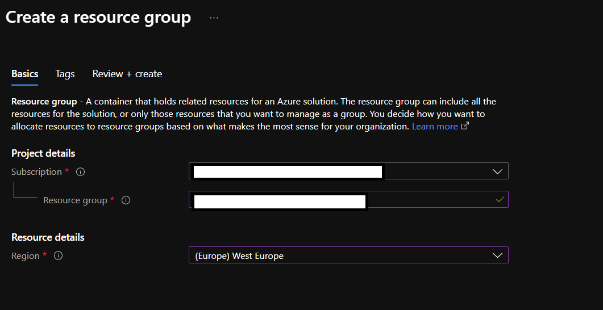

2. Create functions app

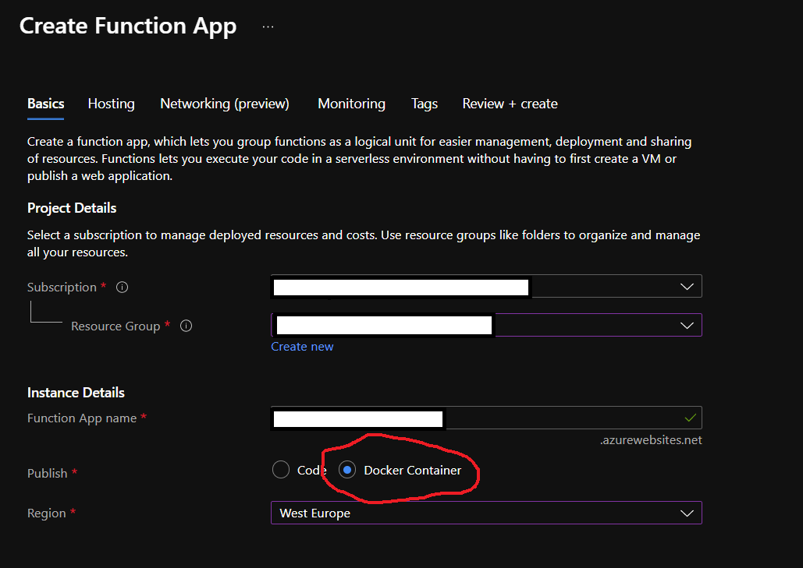

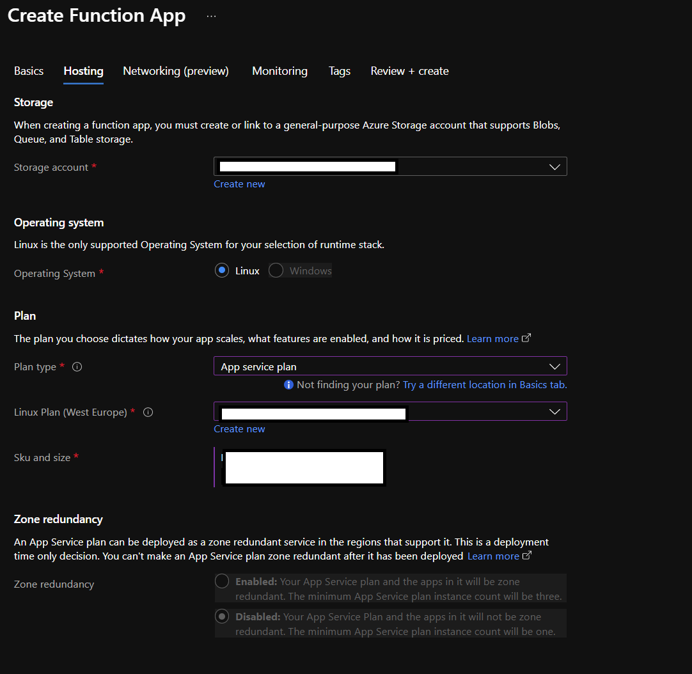

3. Add deploymentslot for test and setup credentials from the Azure Container Registry


# Azure DevOps

1. Setup the pipeline

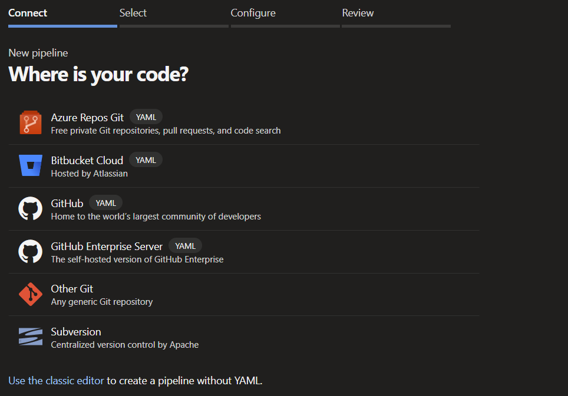

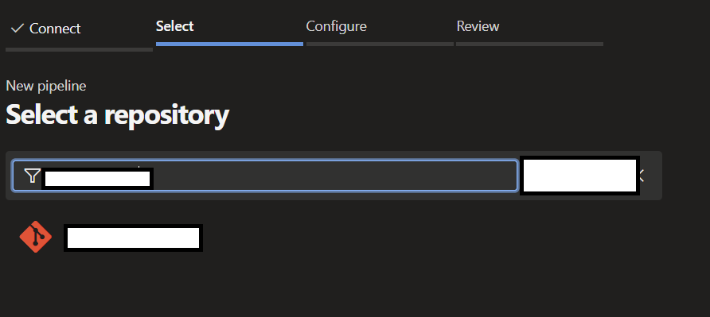

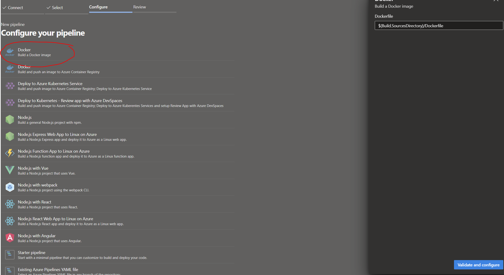

# Don't Save!

If you use a different account for azure devops that doesn't have access to your azure subscriptions you can't use the docker for container registries, so yeah...

Edit the yaml file to be like:

```yaml
trigger:
  - main

jobs:
  - job: BuildDockerImage
    displayName: 'Build Docker Image'
    pool:
      vmImage: 'ubuntu-latest'
    steps:
      - task: Docker@2
        inputs:
          containerRegistry: 'name of your azure container registry' # Your docker registry service connection
          repository: 'Repository Name' # Your docker repository name
          command: 'buildAndPush'
          Dockerfile: '**/Dockerfile'
          addPipelineData: false
          addBaseImageData: false
```

2. Setup the release plan

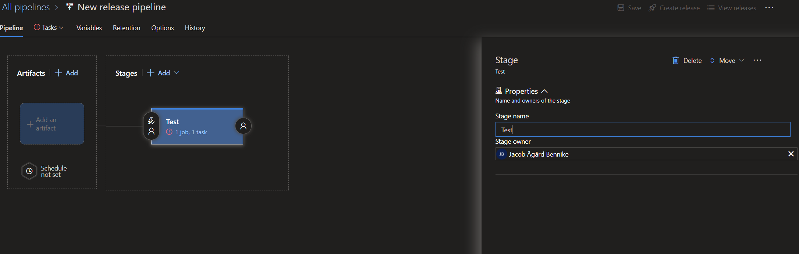

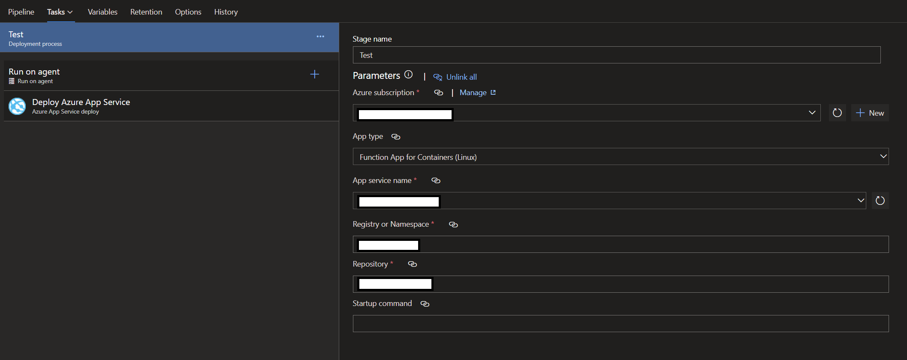

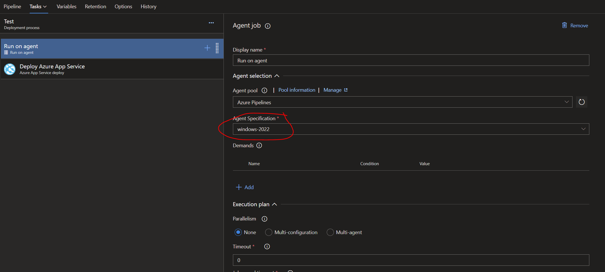

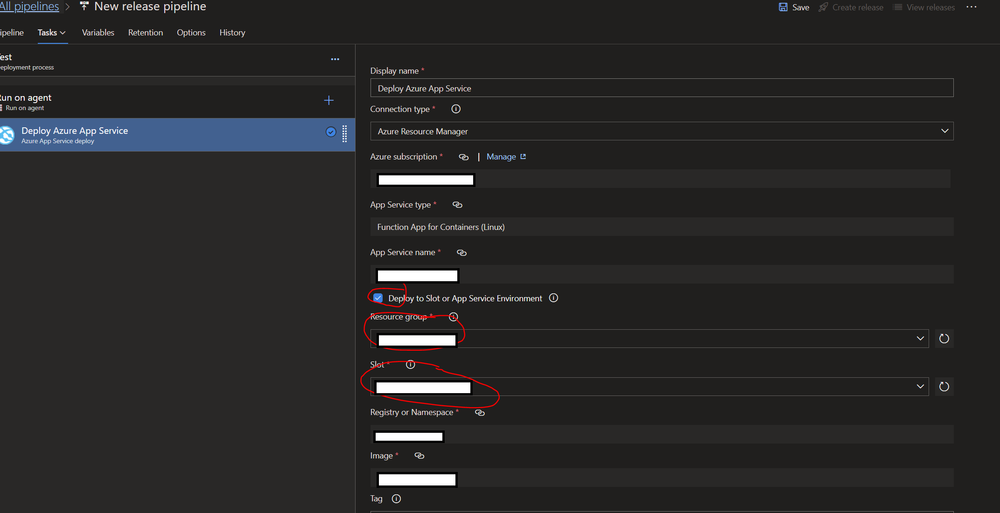

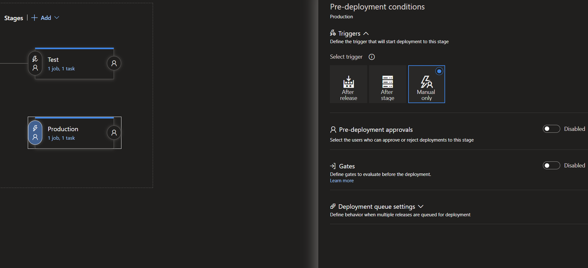

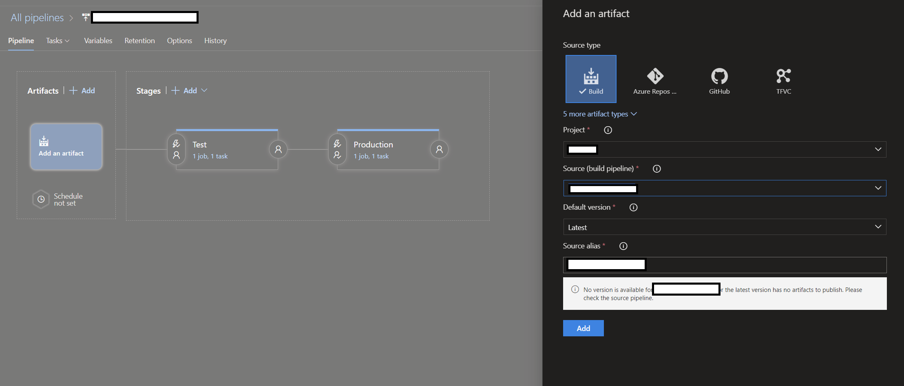

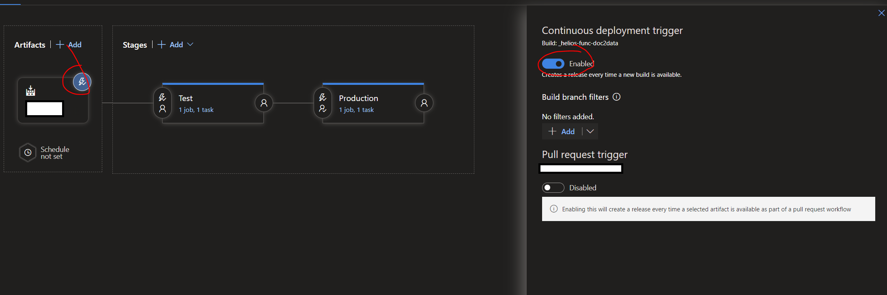

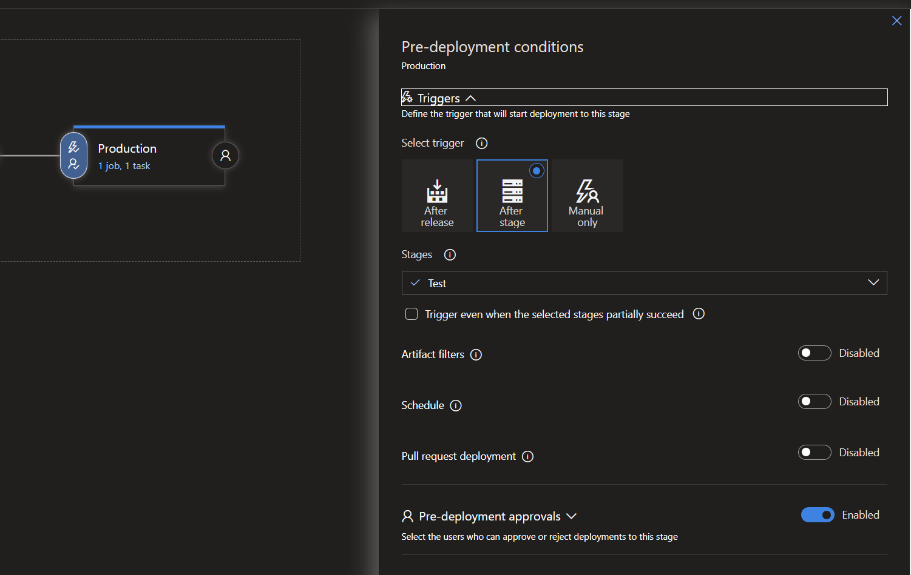

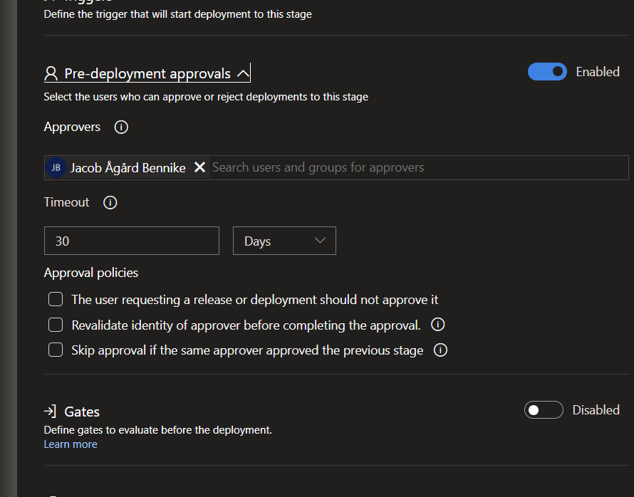

# DONT FORGET TO NAME YOUR RELEASE SETUP LIKE I DID!
